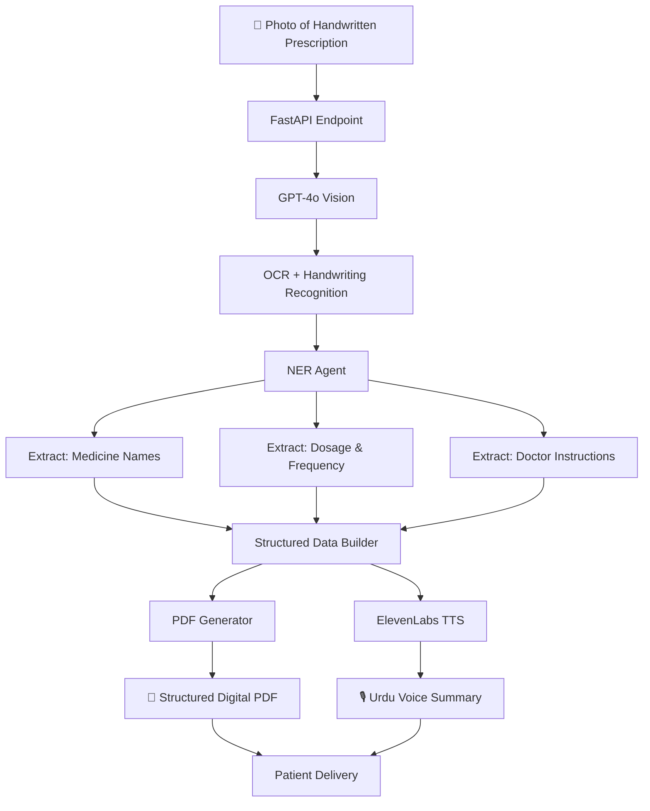
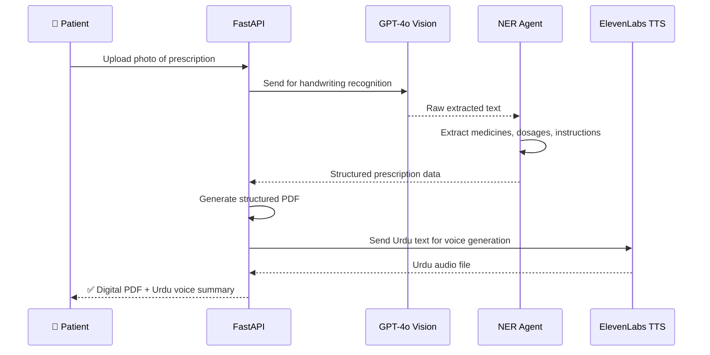

# 📋 Handwritten Prescription Digitizer — GPT-4o Vision + Urdu Voice

> **Production AI pipeline** that converts handwritten doctor 
> prescriptions into structured digital PDFs with Urdu voice 
> summaries — making medical prescriptions accessible to 
> low-literacy patients at Pakistan's largest digital health platform.

---

## 📊 Production Impact

| Metric | Value |
|--------|-------|
| Patient support queries reduced | 35% |
| Input type | Handwritten doctor prescriptions |
| Output | Structured digital PDF + Urdu voice summary |
| Languages | English extraction · Urdu voice output |
| Deployment | AWS · Docker · Production |

---

## 🏗️ System Architecture

---

## ⚡ Key Features

- **GPT-4o Vision OCR** — reads real-world handwritten prescriptions 
  regardless of handwriting quality, ink type, or paper condition
- **NER pipeline** — extracts medicine names, dosages, frequency, 
  and doctor instructions as structured entities
- **Structured PDF generation** — converts unreadable handwriting 
  into clean, organized digital records
- **Urdu voice summary** — ElevenLabs TTS reads the prescription 
  aloud in Urdu for patients who cannot read English
- **Healthcare accessibility** — bridges the literacy and language 
  gap for millions of patients across Pakistan
- **Production deployed** — handling real prescriptions at 
  Pakistan's largest digital health platform daily

---

## 🔄 How It Works

---

## 🛠️ Tech Stack

| Layer | Technology |
|-------|-----------|
| Vision & OCR | GPT-4o Vision |
| Entity Extraction | NER Pipeline, LangChain |
| Voice Generation | ElevenLabs TTS |
| PDF Generation | pdfplumber, Python |
| Backend | FastAPI, Python |
| Deployment | Docker, AWS |

---

## 📸 Sample Results

> Screenshots and sample outputs coming soon

---

## 🎥 Demo Video

> Demo video coming soon

---

> ⚠️ **Note:** This repository showcases the architecture and 
> design of a production system built at Oladoc. Source code 
> is proprietary.

---

## 📫 Contact

**Adnan Abdullah** — Agentic AI Engineer & AI Team Lead

---

*Built with GPT-4o Vision + ElevenLabs · Deployed at Pakistan's 
largest digital health platform · 35% reduction in patient 
support queries*
